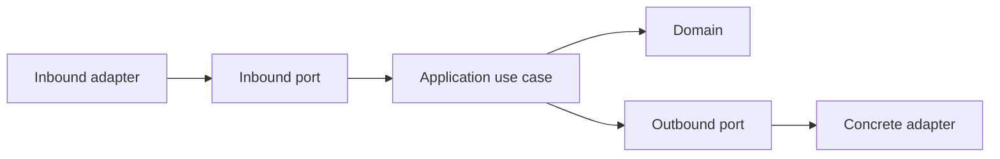

# Application

## Purpose

The `application` package coordinates user-facing use cases without knowing how VS Code, Nextflow, Docker, persistence, or the filesystem implement them.

## Responsibilities

- Define inbound use-case contracts.
- Define outbound ports required by use cases.
- Define request, result, and command-preview DTOs.
- Orchestrate domain behavior through ports.

## Dependency Rules

The application layer may depend on `@nextflow-ide/domain`. It must not import infrastructure APIs or concrete adapter packages.

## Hexagonal Flow

## MVP Use Cases

- `DetectWorkspace`
- `RunPipeline`
- `ResumeRun`
- `StopRun`
- `GetRunHistory`
- `ListArtifacts`

## Testing

Use cases will be tested with fake outbound ports. No application test should require VS Code, Docker, a real Nextflow binary, or a real workspace.

## Sections

See the READMEs under `src/dto`, `src/mappers`, `src/ports`, and `src/use-cases` for contract-level documentation.
