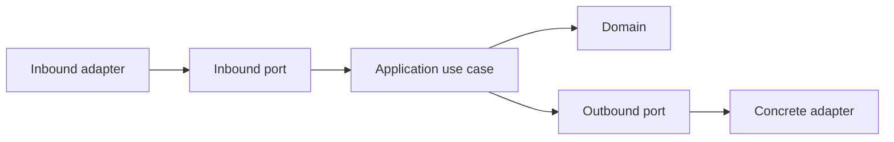

# Application

## Purpose

The `application` package coordinates user-facing use cases without knowing how VS Code, Nextflow, Docker, persistence, or the filesystem implement them.

## Responsibilities

- Define inbound use-case contracts.
- Define outbound ports required by use cases.
- Define request, result, and command-preview DTOs.
- Orchestrate domain behavior through ports.

## Dependency Rules

The application layer may depend on `@nextflow-ide/domain`. It must not import infrastructure APIs or concrete adapter packages.

The executable dependency rule is tested by `packages/test-utils/tests/architecture.test.ts`.

## Hexagonal Flow

## MVP Use Cases

- `DetectWorkspace` is implemented by `DetectWorkspaceService` and returns a typed project or a `not-nextflow-workspace` reason.
- `RunPipeline` is implemented by `RunPipelineService`; it prepares a command, persists a queued run, starts the runtime, updates the run to `running`, and publishes a started event.
- `ResumeRun`
- `StopRun`
- `GetRunHistory`
- `ListArtifacts`

## Testing

Use cases are tested with fake outbound ports in `tests/use-cases.test.ts`. No application test requires VS Code, Docker, a real Nextflow binary, or a real workspace.

## Sections

See the READMEs under `src/dto`, `src/mappers`, `src/ports`, and `src/use-cases` for contract-level documentation.
