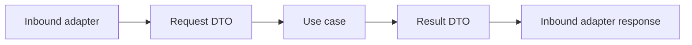

# Application DTOs

## Purpose

DTOs define the input and output shapes of application use cases without exposing adapter implementations.

## Current Contracts

Requests and results exist for workspace detection, run, resume, stop, run history, artifact listing, and command previews.

DTOs should remain serializable and should not contain VS Code, Node, Docker, or process instances.
