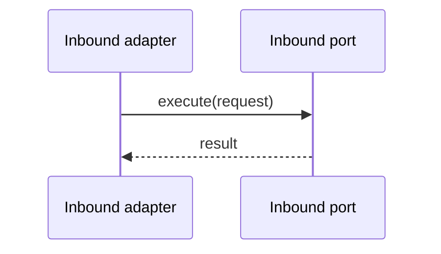

# Inbound Ports

## Purpose

Inbound ports define application actions: detect workspace, run, resume, stop, read history, and list artifacts.

## Contract Rule

Methods return typed result DTOs rather than `void`, so adapters can render state, errors, and command previews without knowing internal services.

