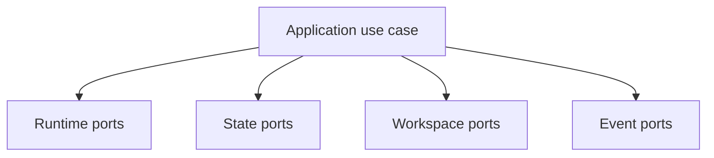

# Outbound Ports

## Purpose

Outbound ports describe infrastructure capabilities required by use cases.

## Current Ports

- `RuntimeGateway`
- `RuntimeCommandFactory`
- `RunRepository`
- `WorkspaceProjectGateway`
- `ArtifactGateway`
- `EventPublisher`
- `IdGenerator`
- `Clock`

Ports contain no concrete process, filesystem, Docker, or VS Code types.
