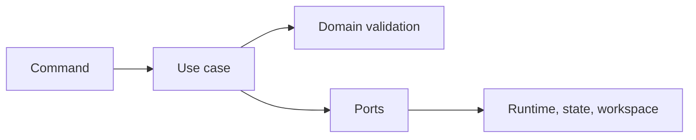

# Application Use Cases

## Purpose

This section contains orchestration services that execute the MVP workflow using domain rules and outbound ports.

## Planned Use Cases

- `DetectWorkspaceService`: delegates workspace inspection and maps an absent project to a typed result reason.
- `RunPipelineService`: prepares a command, creates and persists a queued run, starts the runtime, updates the run to `running`, and publishes the started event.
- `ResumeRunService`: validates a failed or resumable run, prepares a resume command, starts it, persists `running`, and publishes a started event.
- `StopRunService`: validates a cancelable run, requests runtime cancellation, persists `canceled`, and publishes a status event.
- `GetRunHistoryService`: reads runs for a workspace and returns them sorted by last update.
- `GetRunDetailsService`: loads one run by id and returns a typed not-found error when it is absent.
- `ListArtifactsService`: loads a run and delegates report, trace, and timeline discovery to `ArtifactGateway`.
- Get run history.
- List artifacts.

## Current State

`DetectWorkspaceService`, `RunPipelineService`, `ResumeRunService`, `StopRunService`, `GetRunHistoryService`, `GetRunDetailsService`, and `ListArtifactsService` are implemented and covered by application unit tests.
