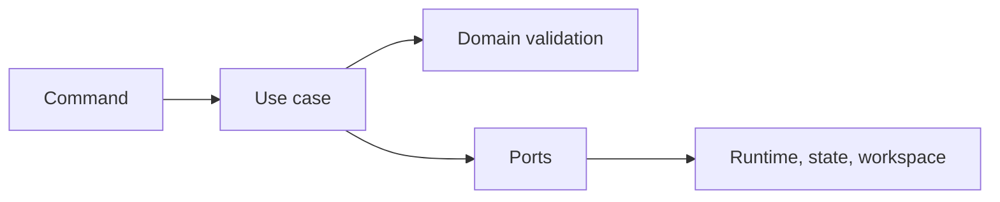

# Application Use Cases

## Purpose

This section will contain orchestration services that execute the MVP workflow using domain rules and outbound ports.

## Planned Use Cases

- Detect workspace.
- Run pipeline.
- Resume run.
- Stop run.
- Get run history.
- List artifacts.

## Current State

Only contracts exist. Implementations must be added with unit tests and corresponding README updates in the same change.
