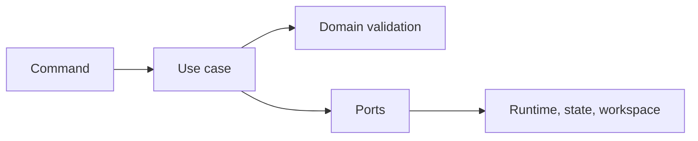

# Application Use Cases

## Purpose

This section contains orchestration services that execute the MVP workflow using domain rules and outbound ports.

## Planned Use Cases

- `DetectWorkspaceService`: delegates workspace inspection and maps an absent project to a typed result reason.
- `RunPipelineService`: prepares a command, creates and persists a queued run, starts the runtime, updates the run to `running`, and publishes the started event.
- Resume run.
- Stop run.
- Get run history.
- List artifacts.

## Current State

`DetectWorkspaceService` and `RunPipelineService` are implemented and covered by application unit tests. Resume, stop, history, and artifact use cases remain contract-only.
