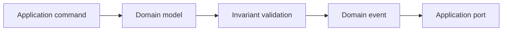

# Domain

## Purpose

The `domain` package is the framework-free core of the Nextflow IDE. It owns business concepts and invariants that must remain valid regardless of VS Code, Node.js, Docker, persistence, or the selected runtime.

## Responsibilities

- Model workspaces, run configurations, runs, statuses, failures, and artifacts.
- Define the legal run lifecycle transitions.
- Publish stable domain event shapes.
- Expose validation and invariant errors.

## Dependency Rules

This package must not import VS Code APIs, Node process or filesystem APIs, Docker libraries, adapter packages, or application services.

The executable dependency rule is tested by `packages/test-utils/tests/architecture.test.ts`.

## Data Flow

## Testing

Unit tests run with Vitest through `domain:test`. Tests must cover legal and illegal transitions, terminal statuses, configuration invariants, and event shape stability.

## Current API

- `Run`, `RunConfiguration`, `WorkspaceProject`, and artifact types in `src/model`.
- Transition helpers in `src/services`.
- Runtime policies in `src/policies`.
- `ExecutionEvent` in `src/events`.
- `DomainInvariantError` in `src/errors`.
