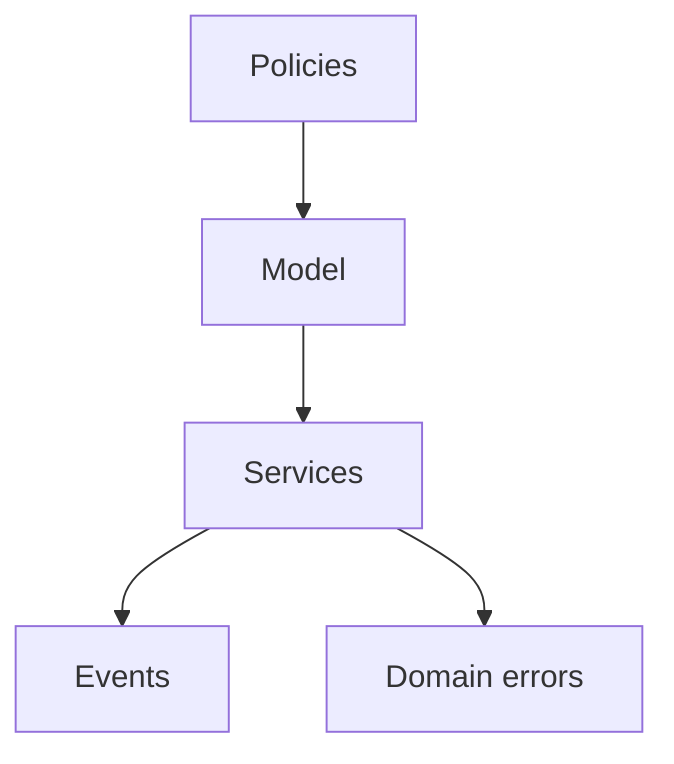

# Domain Source

The domain source tree is split into model, services, policies, events, and errors. All modules are framework-free and define the business vocabulary and invariants used by application use cases.

Changes to any domain section require unit tests and an updated README when responsibilities, invariants, or public contracts change.
