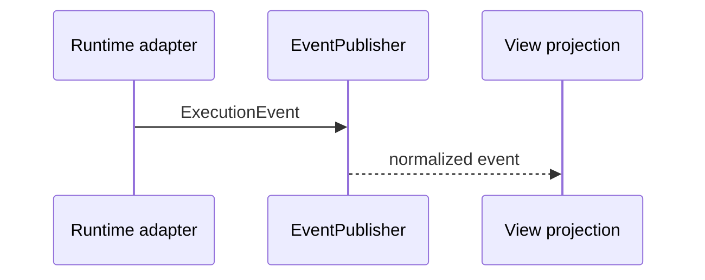

# Domain Events

## Purpose

Defines stable execution events exchanged between the domain-facing application layer and adapters or projections.

## Event Kinds

- `started`
- `log`
- `status-changed`
- `artifacts-discovered`

Events contain a run identifier and occurrence timestamp so consumers can correlate asynchronous process output.
