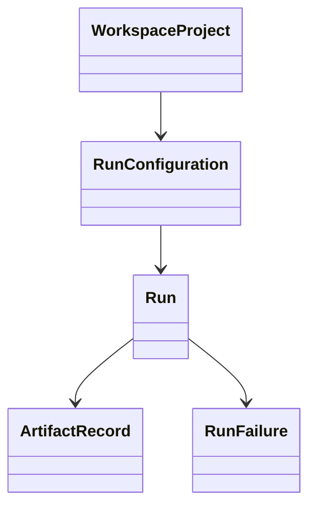

# Domain Model

## Purpose

Defines the canonical entities shared by all application workflows.

## Main Types

- `WorkspaceProject`: normalized project context.
- `RunConfiguration`: immutable execution intent.
- `Run`: concrete execution record.
- `ArtifactRecord`: normalized report, trace, or timeline metadata.
- `RunFailure`: recoverable or terminal failure information.

## Invariants

A run always has an identifier, a configuration, a status, timestamps, and an artifact collection. Runtime mode is limited to supported domain policies.

## Testing

Model tests should verify required fields, readonly boundaries, and compatibility with persistence DTOs.
