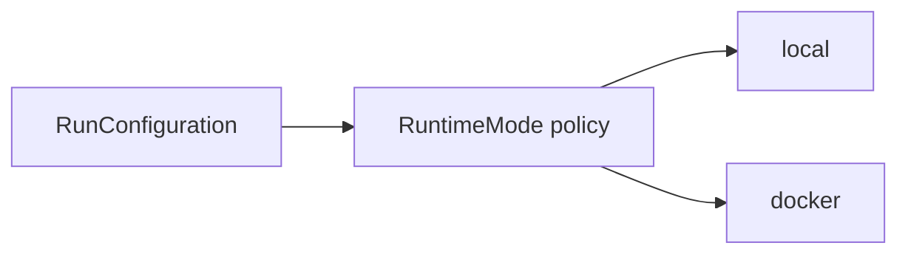

# Domain Policies

## Purpose

Defines closed sets and policy values that constrain domain behavior without depending on infrastructure.

## Current Policies

- Supported runtime modes: `local` and `docker`.
- Supported artifact kinds: `report`, `trace`, and `timeline`.

## Extension Point

New runtime modes require a domain policy change, adapter implementation, tests, and synchronized documentation.
