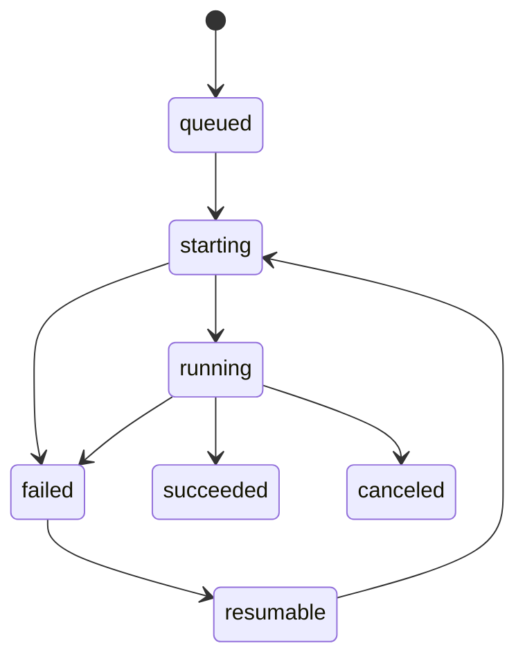

# Domain Services

## Purpose

Contains domain behavior that does not belong to a single entity, especially run lifecycle validation.

## Run State Machine

`assertRunStatusTransition` throws `DomainInvariantError` for invalid transitions. Terminal states cannot transition further.

## Testing

`packages/domain/tests/run-state.test.ts` is the executable specification for legal and illegal transitions.
