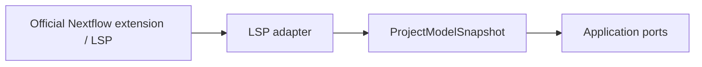

# LSP Adapters

## Purpose

This package is the anti-corruption layer between official Nextflow language intelligence and the internal project model.

## Responsibilities

- Detect whether the official extension is installed.
- Consume stable LSP or extension metadata.
- Translate external project information into internal records.
- Avoid duplicating Nextflow parsing logic.

## Testing

Tests use mocked extension metadata and verify behavior both with and without the official extension installed.
