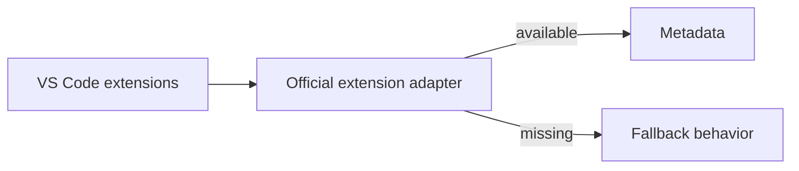

# Official Nextflow Extension Adapter

Detects and consumes optional capabilities from the official Nextflow VS Code extension.

The MVP must continue to work when this extension is absent. This adapter is additive and must not become a hard dependency for local execution.

