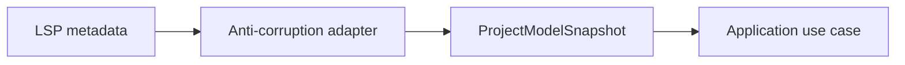

# LSP Project Model

Translates external language-server or extension metadata into stable internal project snapshots.

```mermaid
flowchart LR
  L[LSP metadata] --> A[Anti-corruption adapter]
  A --> P[ProjectModelSnapshot]
  P --> U[Application use case]
```

The internal model must not expose LSP implementation types.
