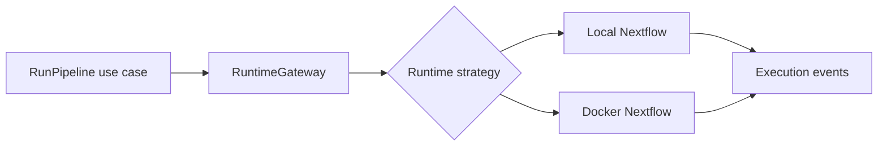

# Runtime Adapters

## Purpose

This package translates the application runtime ports into local Nextflow and Docker process execution.

## Responsibilities

- Build deterministic local and Docker commands.
- Perform runtime preflight checks.
- Launch, monitor, cancel, and resume processes.
- Translate stdout, stderr, exit codes, and process failures into application events.

## Dependency Rules

Adapters may depend on application and domain contracts. They must not leak Node.js or Docker types through the application ports.

## Testing

Command construction and runtime selection are unit tested without launching processes. Process integration tests use controlled fixtures and are separate from pure command tests.

`NextflowCommandBuilder` supports local and Docker modes, profiles, params files, resume, custom arguments, working directories, environment values, and display-safe command previews.

`LocalNextflowRuntime` launches local processes, while `DockerNextflowRuntime` launches Docker processes through the same lifecycle contract. Both stream output through `EventPublisher`, map exit codes to run statuses, and support cancellation.

`DockerNextflowRuntime` and `RuntimeRouter` now provide the same lifecycle contract for Docker mode. Runtime selection is based on `RunConfiguration.runtimeMode`.
