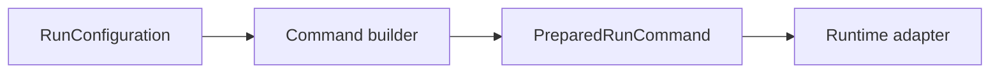

# Command Builder

Builds a deterministic executable, argument list, working directory, environment, and display command from a validated run configuration.

It must never concatenate untrusted shell fragments or hide the final command from the user. Tests cover spaces, profiles, params files, environment values, and resume flags.

`NextflowCommandBuilder` returns argument arrays for process APIs. `displayCommand` is a human-readable preview and is not used as the process invocation string.
