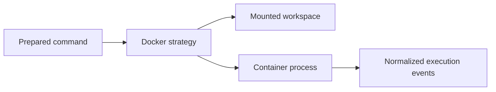

# Docker Nextflow Adapter

Implements the runtime strategy for launching Nextflow through Docker.

Responsibilities include image selection, workspace path mapping, Docker availability checks, and translating container process output.

Docker-specific flags remain inside this adapter.
