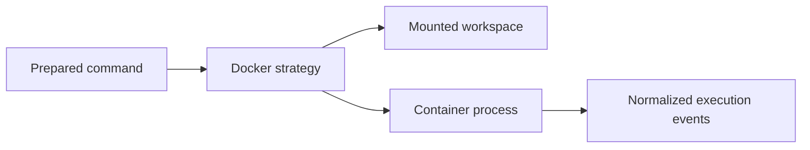

# Docker Nextflow Adapter

Implements the runtime strategy for launching Nextflow through Docker.

Responsibilities include image selection, workspace path mapping, Docker availability checks, and translating container process output.

Docker-specific flags remain inside this adapter.

`DockerNextflowRuntime` performs Docker preflight, launches the prepared Docker command, streams output, maps terminal states, and supports cancellation.

The default image is pinned to `nextflow/nextflow:26.04.6`; runtime images must be version-pinned because the Docker Hub repository does not provide a stable `latest` tag. The command explicitly invokes `nextflow` after the image because the image entrypoint is a shell wrapper.
