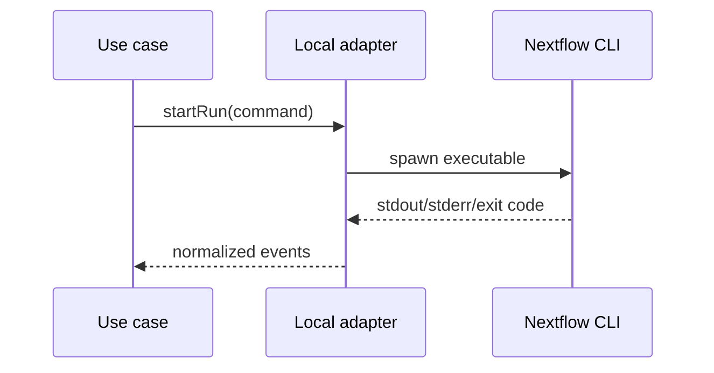

# Local Nextflow Adapter

Runs the Nextflow CLI on the host machine through the runtime outbound ports.

This adapter owns Node process details; those details must not cross into domain or application contracts.

`LocalNextflowRuntime` now performs preflight, launches through the injected `ProcessLauncher`, publishes stdout/stderr and terminal status events, and supports SIGTERM cancellation. The Docker strategy and real VS Code wiring remain separate.
