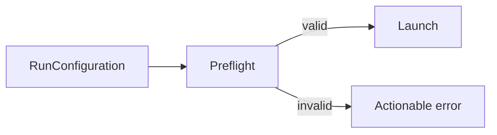

# Runtime Preflight

Checks whether the selected runtime can execute before a run is registered as active.

Checks include the Nextflow executable for local mode and Docker availability for Docker mode.

