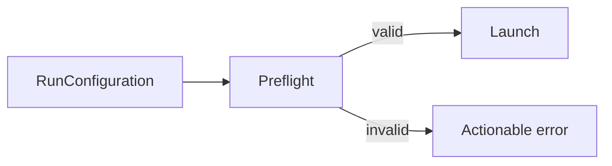

# Runtime Preflight

Checks whether the selected runtime can execute before a run is registered as active.

Checks include the Nextflow executable for local mode and Docker availability for Docker mode.

`NextflowExecutablePreflight` invokes `nextflow -version` and returns a boolean result. Docker preflight remains to be implemented with the Docker strategy.

