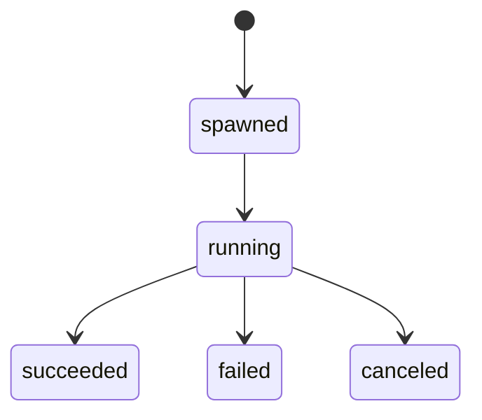

# Process Monitor

Converts process output and lifecycle signals into normalized execution events.

It owns stdout/stderr listeners, cancellation handles, exit-code mapping, and cleanup after completion.

