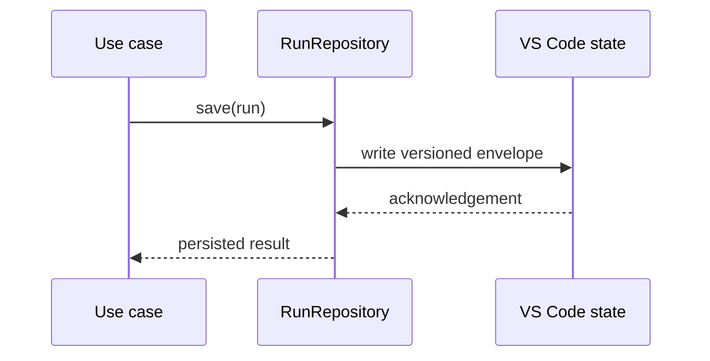

# State Adapters

## Purpose

This package persists and restores application state using VS Code workspace and global state mechanisms.

## Responsibilities

- Store run records and configuration snapshots.
- Serialize and deserialize versioned envelopes.
- Apply migrations between persistence schema versions.
- Keep persistence details outside domain and application code.

## Testing

Repository tests use an in-memory state fake and verify round trips, corrupted data handling, retention, and migrations.
