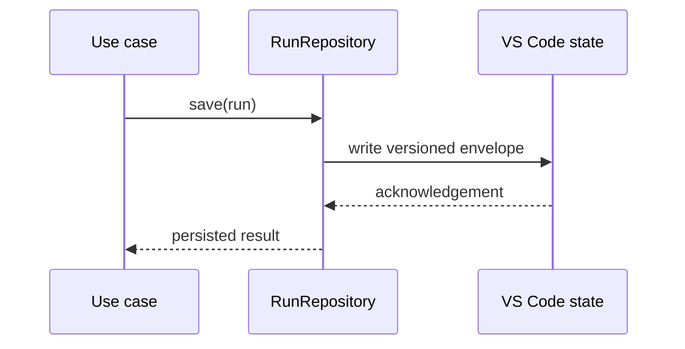

# State Adapters

## Purpose

This package persists and restores application state using VS Code workspace and global state mechanisms.

## Responsibilities

- Store run records and configuration snapshots.
- Serialize and deserialize versioned envelopes.
- Apply migrations between persistence schema versions.
- Keep persistence details outside domain and application code.

`MementoRunRepository` implements `RunRepository` over the generic `StateStore` port. The current schema is version 1 and stores all runs in the `nextflow-ide.run-history` key.

## Testing

Repository tests use an in-memory state fake and verify save, update, lookup, workspace filtering, invalid state handling, and unknown-run protection.
