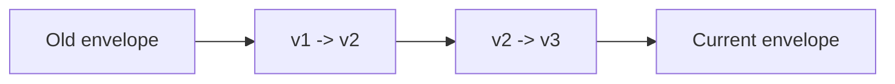

# State Migrations

Applies ordered schema migrations when persisted run data is older than the current version.

```mermaid
flowchart LR
  O[Old envelope] --> M1[v1 -> v2]
  M1 --> M2[v2 -> v3]
  M2 --> C[Current envelope]
```

Each migration must be deterministic and covered by compatibility tests.
