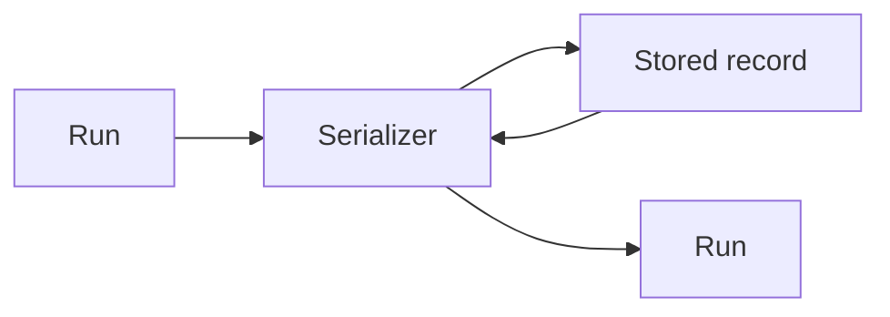

# State Serializers

Converts domain run records to versioned persistence-safe records and back.

Serializers must handle optional fields, unknown future fields, and invalid stored content without exposing raw persistence formats to the domain.

The current serializer writes `{ schemaVersion: 1, payload: { runs } }`. Invalid or unknown versions are treated as an empty history until migrations are added.

