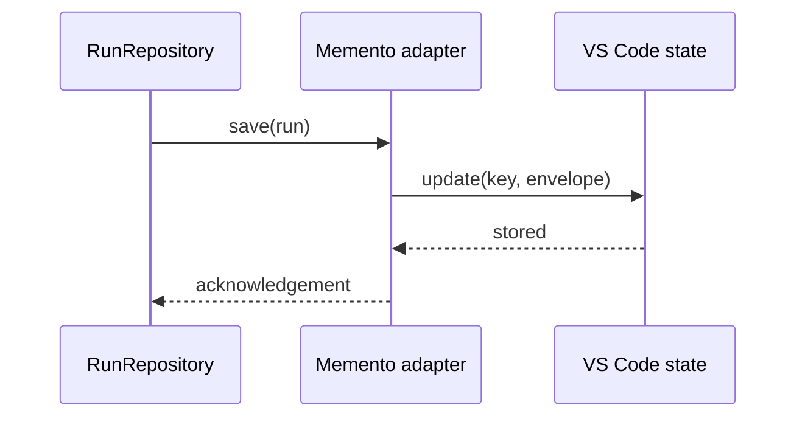

# VS Code Memento Adapter

Persists run history through VS Code workspace and global state APIs.

`StateStore` is the infrastructure-neutral port. `MementoRunRepository` uses it to persist a versioned run-history envelope without importing the VS Code API directly.

