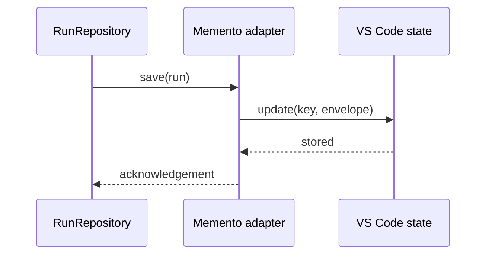

# VS Code Memento Adapter

Persists run history through VS Code workspace and global state APIs.

```mermaid
sequenceDiagram
  participant R as RunRepository
  participant M as Memento adapter
  participant V as VS Code state
  R->>M: save(run)
  M->>V: update(key, envelope)
  V-->>M: stored
  M-->>R: acknowledgement
```
