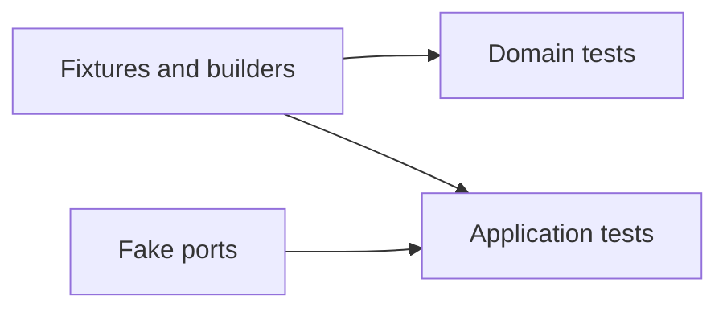

# Test Utilities

## Purpose

This package provides shared fixtures, builders, and fake ports for isolated tests.

## Responsibilities

- Build valid domain objects with sensible defaults.
- Provide fake runtime, repository, workspace, artifact, and event ports.
- Provide representative Nextflow workspace fixtures.

## Dependency Rules

Test utilities may depend on domain and application contracts. Production packages must never depend on this package.

## Testing

The package itself contains architecture tests and should remain deterministic and side-effect free.
