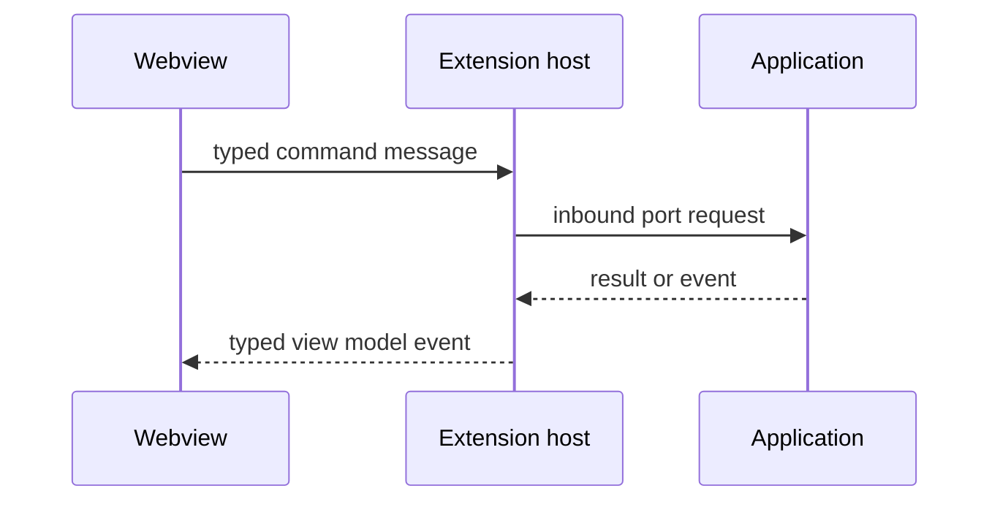

# UI Contracts

## Purpose

This package defines the typed protocol between the extension host and future webview clients.

## Responsibilities

- Define inbound UI command messages.
- Define outbound UI event messages.
- Define stable view models for runs, logs, artifacts, and errors.
- Keep UI transport details out of the application core.

## Testing

Contract tests should reject unknown message types and verify serialization-compatible payloads.
