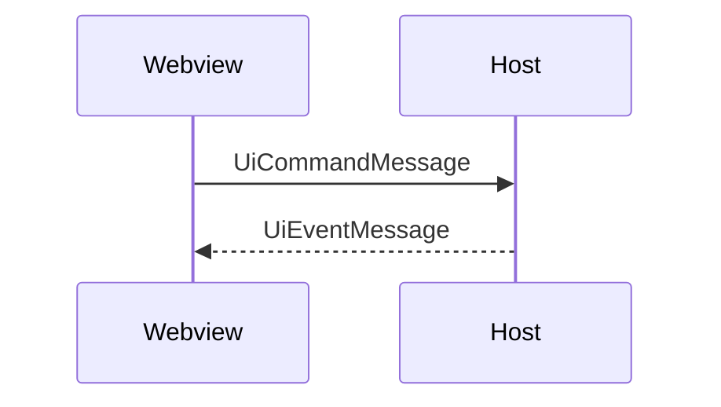

# UI Messages

Defines typed commands from webviews to the extension host and typed events from the host to webviews.

Examples include run, resume, stop, open artifact, and refresh history.

```mermaid
sequenceDiagram
  participant W as Webview
  participant H as Host
  W->>H: UiCommandMessage
  H-->>W: UiEventMessage
```
