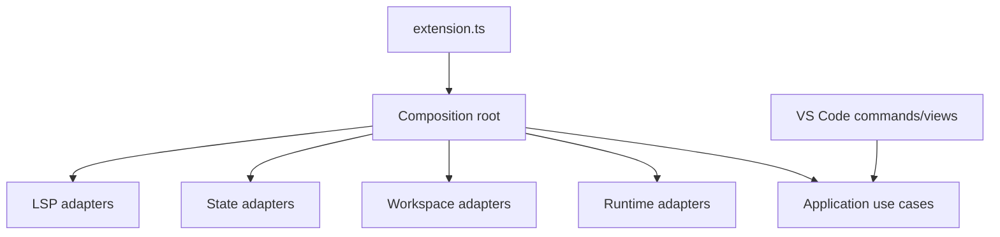

# VS Code Extension

Public product: **qbiotic-flow**. Author: Pablo Pimàs Verge ([pablo@pimas.cat](mailto:pablo@pimas.cat)).

## Purpose

This package is the outer composition root and inbound adapter for the qbiotic-flow extension.

## Responsibilities

- Activate and deactivate the extension.
- Register commands, views, output channels, and webviews.
- Instantiate concrete adapters and application use cases.
- Translate VS Code events into typed application requests.

The extension currently provides `nextflowIde.runPipeline`, `nextflowIde.resumeRun`, `nextflowIde.stopRun`, `nextflowIde.showRunDetails`, and `nextflowIde.selectWorkspaceRoot`, plus a `qbiotic-flow Runs` Activity Bar view using the root `qbiotic.svg` brand asset. The Runs view keeps a play button in its title bar so another pipeline can be launched after runs already exist. Run supports multi-root selection, nested pipeline discovery when `main.nf` is not at the workspace root, Quick Pick entrypoint selection with an optional file-browser fallback, discovered config profiles, comma-separated profile overrides, and an optional JSON/YAML params file selected through Quick Pick with an explicit file-browser option.

Activation is scoped to workspaces containing `main.nf` or to one of the contributed commands/views; the official Nextflow extension is not required.

## Composition Root

## Dependency Rules

This is the only package allowed to know how concrete adapters are assembled. Business rules must remain in domain and application.

## Testing

The extension package typechecks against the VS Code API. Full activation scenarios still require `@vscode/test-electron`.

## Packaging

Run `pnpm run package:vsix` from the repository root to create `dist/qbiotic-flow.vsix`. The `package` target depends on `bundle`, which uses esbuild to inline all `@nextflow-ide/*` workspace dependencies into a self-contained `dist/extension.cjs` (the extension's `main` entry point). This is required because the installed VSIX has no `node_modules`, so the workspace packages must be bundled rather than required at runtime.

## Manual Smoke Test

Use the `Run qbiotic-flow Extension` launch configuration from `.vscode/launch.json`. It builds the extension, opens an Extension Development Host against `examples/minimal-pipeline`, and exposes the Run command and Runs view. The fixture has been verified with Nextflow 26.04.6 outside the Extension Development Host.
