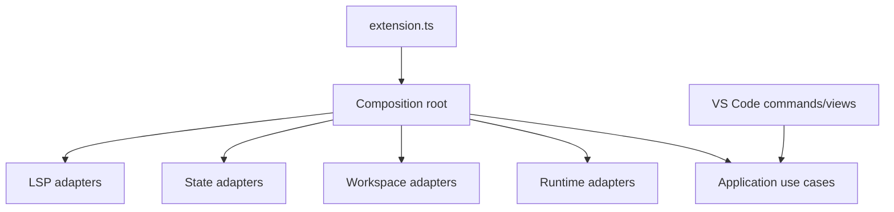

# VS Code Extension

## Purpose

This package is the outer composition root and inbound adapter for the Nextflow IDE extension.

## Responsibilities

- Activate and deactivate the extension.
- Register commands, views, output channels, and webviews.
- Instantiate concrete adapters and application use cases.
- Translate VS Code events into typed application requests.

The extension currently provides `nextflowIde.runPipeline`, `nextflowIde.resumeRun`, `nextflowIde.stopRun`, `nextflowIde.showRunDetails`, and `nextflowIde.selectWorkspaceRoot`, plus a `Nextflow Runs` Explorer view. Run supports multi-root selection, multiple entrypoints, discovered config profiles, comma-separated profile overrides, and an optional params file. The Runs view can switch its active root independently.

Activation is scoped to workspaces containing `main.nf` or to one of the contributed commands/views; the official Nextflow extension is not required.

## Composition Root

## Dependency Rules

This is the only package allowed to know how concrete adapters are assembled. Business rules must remain in domain and application.

## Testing

The extension package typechecks against the VS Code API. Full activation scenarios still require `@vscode/test-electron`.

## Manual Smoke Test

Use the `Run Nextflow IDE Extension` launch configuration from `.vscode/launch.json`. It builds the extension, opens an Extension Development Host against `examples/minimal-pipeline`, and exposes the Run command and Runs view. The fixture has been verified with Nextflow 26.04.6 outside the Extension Development Host.
