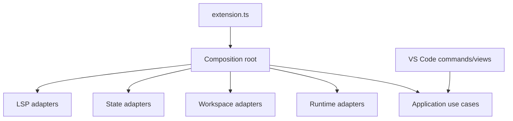

# VS Code Extension

## Purpose

This package is the outer composition root and inbound adapter for the Nextflow IDE extension.

## Responsibilities

- Activate and deactivate the extension.
- Register commands, views, output channels, and webviews.
- Instantiate concrete adapters and application use cases.
- Translate VS Code events into typed application requests.

## Composition Root

## Dependency Rules

This is the only package allowed to know how concrete adapters are assembled. Business rules must remain in domain and application.

## Testing

Activation and command tests use VS Code test doubles. Full extension scenarios use `@vscode/test-electron` once the extension manifest and commands are complete.
