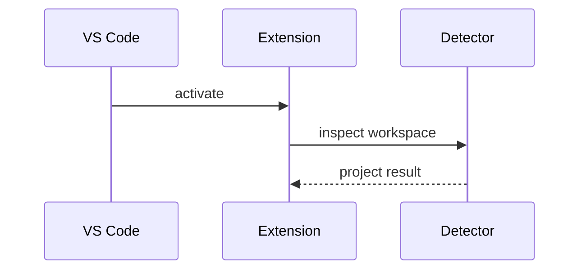

# Extension Activation

Owns activation conditions and lifecycle entrypoints. Activation should remain lightweight and defer expensive discovery until a relevant workspace or command requires it.

```mermaid
sequenceDiagram
  participant V as VS Code
  participant E as Extension
  participant D as Detector
  V->>E: activate
  E->>D: inspect workspace
  D-->>E: project result
```
