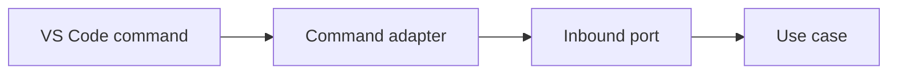

# VS Code Commands

Inbound adapters translate command-palette and context-menu actions into application port requests.

Commands must validate input, delegate immediately, and avoid business logic.

The registered commands include `nextflowIde.runPipeline`, `nextflowIde.resumeRun`, `nextflowIde.stopRun`, and `nextflowIde.selectWorkspaceRoot`. Run selects a workspace root when multiple roots are open, accepts optional profiles and a JSON/YAML params file selected through the file picker, and requires `main.nf`; the root selector controls the Runs view independently.

