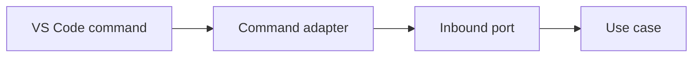

# VS Code Commands

Inbound adapters translate command-palette and context-menu actions into application port requests.

Commands must validate input, delegate immediately, and avoid business logic.

The registered commands include `nextflowIde.runPipeline`, `nextflowIde.resumeRun`, `nextflowIde.stopRun`, and `nextflowIde.selectWorkspaceRoot`. Run selects a workspace root when multiple roots are open, falls back to a nested `main.nf` when the workspace root does not contain one, selects detected entrypoints through Quick Pick with an optional file-browser fallback, accepts optional profiles, and offers an optional JSON/YAML params file through Quick Pick with an explicit file-browser option. The root selector controls the Runs view independently.

