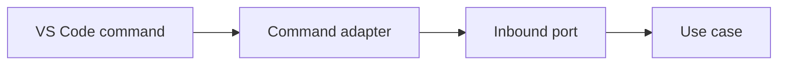

# VS Code Commands

Inbound adapters translate command-palette and context-menu actions into application port requests.

Commands must validate input, delegate immediately, and avoid business logic.

The registered commands are `nextflowIde.runPipeline`, `nextflowIde.resumeRun`, and `nextflowIde.stopRun`. Run requires an open workspace with `main.nf`; Resume and Stop currently receive a run id and report results through the extension output channel.

