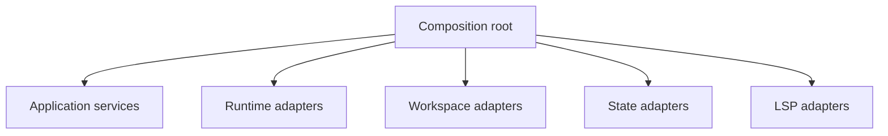

# Composition Root

The composition root is the only place where concrete adapters are instantiated and connected to application use cases.

It must not contain domain rules. Its responsibility is dependency injection and lifecycle ownership.
