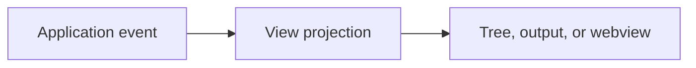

# Extension Views

Owns native tree views, output channels, panels, and future webview hosts.

Views consume application results and UI contracts. They do not launch processes or access persistence directly.

