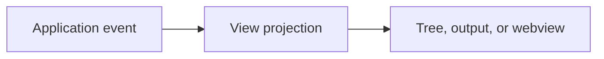

# Extension Views

Owns native tree views, output channels, panels, and future webview hosts.

Views consume application results and UI contracts. They do not launch processes or access persistence directly.

The current native view is `Nextflow Runs`, backed by `RunsTreeDataProvider` and `GetRunHistoryService`. It lists runs for the first workspace folder and displays status as the item description.

