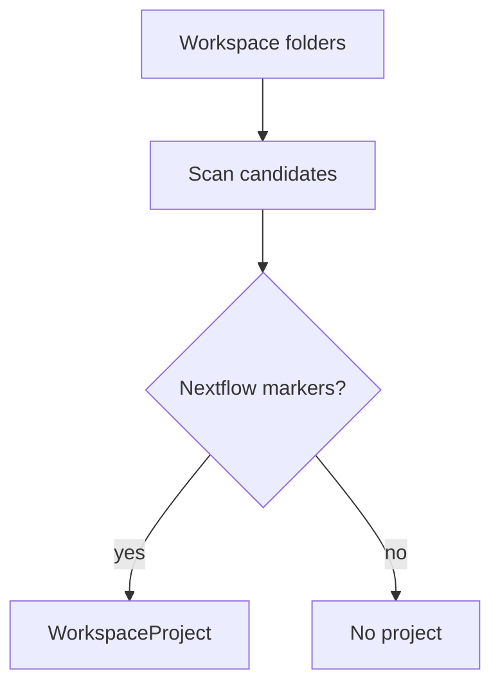

# Project Detection

Detects Nextflow workspaces from entrypoints such as `main.nf`, configuration files, modules, and multi-root folder context.

The adapter returns normalized project data through `WorkspaceProjectGateway`.
