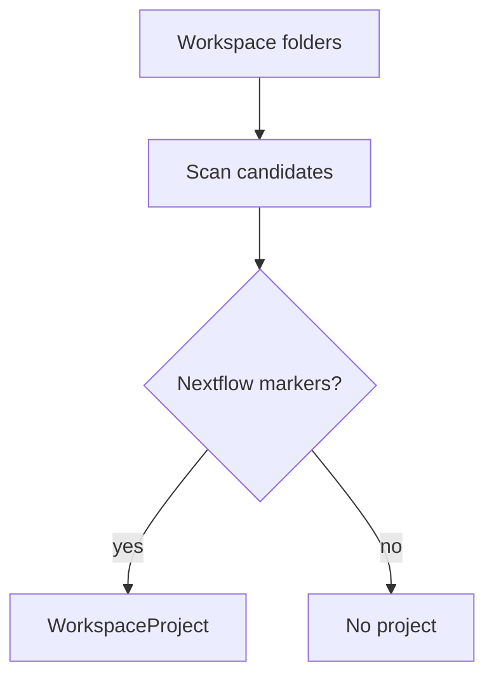

# Project Detection

Detects Nextflow workspaces from entrypoints such as `main.nf`, configuration files, modules, and multi-root folder context.

The adapter returns normalized project data through `WorkspaceProjectGateway`.

The detector requires `main.nf` at the selected workspace root, discovers additional root-level `.nf` entrypoints, reads optional `nextflow.config`, extracts names from the `profiles {}` block, and separates nested `.nf` files as modules.
