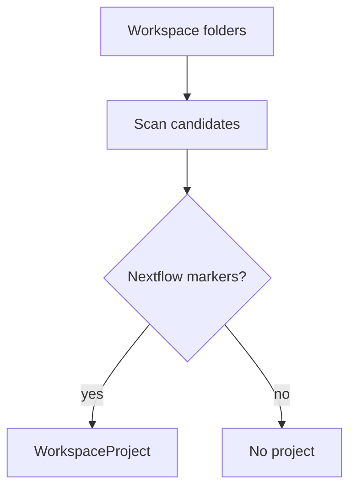

# Project Detection

Detects Nextflow workspaces from entrypoints such as `main.nf`, configuration files, modules, and multi-root folder context.

The adapter returns normalized project data through `WorkspaceProjectGateway`.

The detector prefers `main.nf` at the selected workspace root, but falls back to the first nested `main.nf` found inside that workspace when needed. It discovers additional root-level `.nf` entrypoints for the detected pipeline root, reads optional `nextflow.config`, extracts names from the `profiles {}` block, and separates nested `.nf` files as modules.
