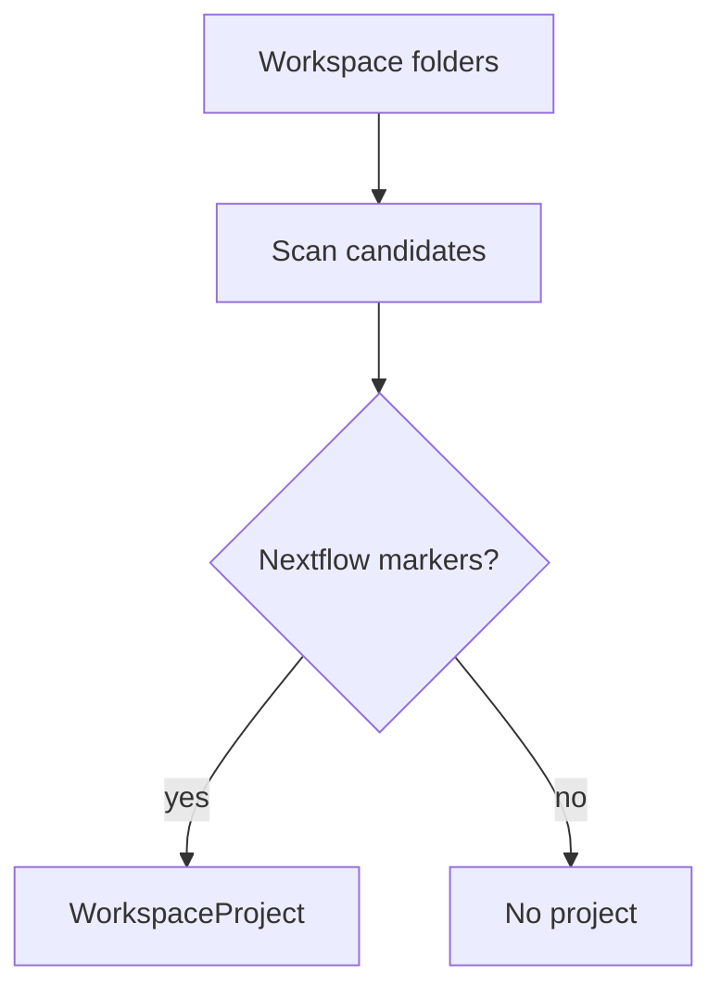

# Project Detection

Detects Nextflow workspaces from entrypoints such as `main.nf`, configuration files, modules, and multi-root folder context.

The adapter returns normalized project data through `WorkspaceProjectGateway`.

The current rule requires `main.nf` at the selected workspace root. `nextflow.config` is optional. Module paths are discovered through the injected `WorkspaceFileSystem`; profile extraction is deferred until configuration parsing is specified.
